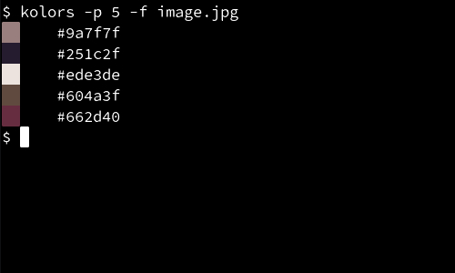

## Installation

To install kolors run these commands:

```bash
$ pip install colorthief sty
$ git clone https://github.com/pNeal0/kolors
$ cd kolors
$ chmod +x main.py
# ln -s "$PWD/main.py" /usr/bin/kolors
```

## Usage

```bash
$ kolors --help
usage: kolors [-h] [-d] [-t] -p PRECISION -f FILE

Generate a color palette from an image

options:
  -h, --help            show this help message and exit
  -d, --decimal         present colors in decimal form instead of hex
  -t, --text            don't display graphical representation of colors
  -p PRECISION, --precision PRECISION
  -f FILE, --file FILE
```

## Example

